<div align="center">

# 🍌 YOLO + Campos Potenciais com ROS 2

### Navegação autônoma em CoppeliaSim: o robô **vê** as bananas, **desvia** das fezes e decide sozinho para onde ir


**IA368 · Doutorado · UNICAMP**

</div>

---

## 📌 Visão geral

O `myRobot`, um robô de tração diferencial, precisa **coletar todas as bananas** de uma sala sem **pisar nas fezes**.
A dificuldade é que ele **não conhece as posições** dos objetos: os sinais `banana`/`poop` do simulador **não são usados**.
Tudo o que o robô sabe vem da câmera **Kinect RGB-D**.

<div align="center">

| 🎯 Resultado | |
|:---|:---:|
| Bananas coletadas | **20/20 · 19/20 · 20/20** |
| Fezes atropeladas | **0** em todas as execuções |
| mAP50 do detector (banana / fezes) | **0,978 / 0,951** |
| Tempo de treinamento | **143 s** (RTX 4060) |

</div>

---

## 🧭 Pipeline

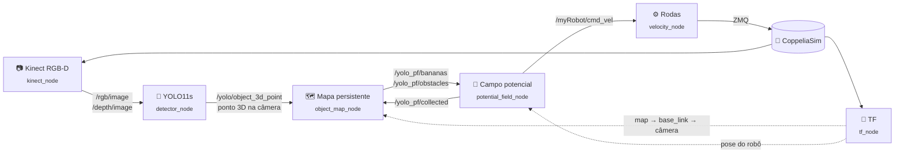

| Nó | Origem | Função |
|---|---|---|
| `kinect_node` | curso | Publica as imagens RGB e de profundidade da Kinect e inicia a simulação. |
| `tf_node` | curso | Publica `map → base_link → camera_color_optical_frame`. |
| `detector_node` | **este projeto** | YOLO + profundidade → posição 3D de cada objeto. |
| `object_map_node` | **este projeto** | Mapa persistente de bananas e fezes, sem duplicatas. |
| `potential_field_node` | **este projeto** | Força atrativa + repulsiva → direção → `cmd_vel`. |
| `velocity_node` | **este projeto** | `cmd_vel` → velocidade de cada roda do `myRobot`. |

---

## 🧠 Por que treinar um YOLO próprio?

O código base do curso usa o `yolo11n-seg` (COCO), cuja ideia é tratar as fezes como *donuts*.
Testamos três modelos pré-treinados na própria cena. **Os três detectam as bananas, mas nenhum detecta as fezes:**

| Modelo | Bananas | Fezes |
|---|:---:|:---:|
| `yolo11n-seg` (base do curso) | ✅ | ❌ confundidas com *bird*, *cow*, *frisbee* |
| `yolo11x-seg` (o maior) | ✅ | ❌ |
| YOLO-World com texto (*"poop"*, *"donut"*, *"brown pile"*) | ✅ | ❌ |

<details>
<summary>🔍 Ver as detecções dos modelos pré-treinados</summary>

**`yolo11n-seg`**: as fezes (montinhos marrons ao fundo) viram *bird*, *cow* ou nada.
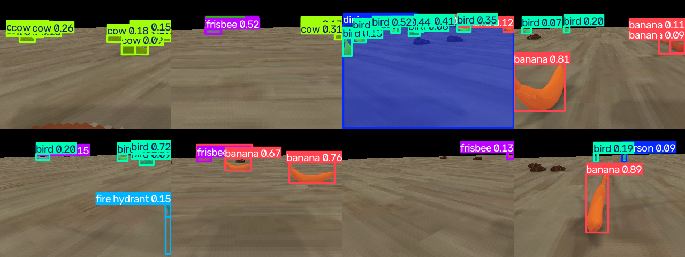

**YOLO-World**, mesmo com o texto "poop": só bananas.
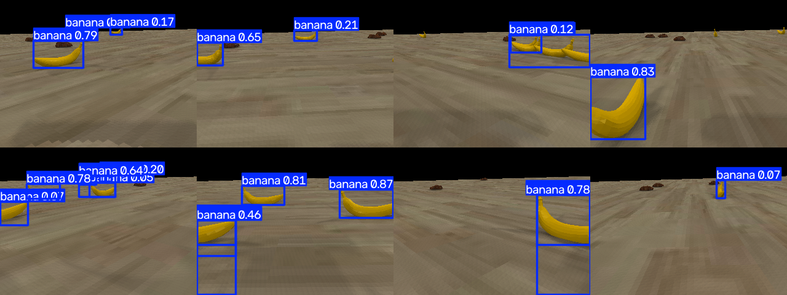

</details>

👉 A solução foi **treinar um YOLO11s com 2 classes (`banana`, `poop`) usando imagens da própria simulação**.

---

## 🏭 Processo de treinamento

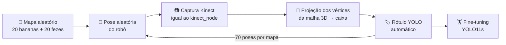

### 1️⃣ Geração automática do dataset ([`training/generate_dataset.py`](training/generate_dataset.py))

Como o simulador sabe onde está cada objeto, **nenhuma caixa foi desenhada à mão**:

1. **Mapa novo:** reinicia a simulação, e o script `buildScene` sorteia 20 bananas e 20 fezes.
2. **Robô em pose aleatória:**
   * 70 % das vezes ele é colocado olhando para algum objeto, a 0,4–2,5 m;
   * 30 % das vezes a pose é totalmente aleatória;
   * nunca em cima de um objeto, senão o robô o coletaria.
3. **Captura da Kinect** com o mesmo processamento do `kinect_node` (flip vertical, RGB → BGR). Assim, o modelo treina com as mesmas imagens que verá em operação.
4. **Rótulo automático:** os vértices da malha 3D de cada objeto são projetados na imagem com o modelo *pinhole* calibrado da câmera:

$$u = \frac{W}{2} - f\,\frac{x}{z}, \qquad v = \frac{H}{2} - f\,\frac{y}{z}, \qquad f = \frac{W/2}{\tan(\text{fov}/2)} = 294{,}68\ \text{px}$$

   A caixa é o mínimo e o máximo dos vértices projetados. São descartados objetos com menos de 4 px, cortados em mais de 60 % ou a mais de 3,5 m (o alcance da Kinect).

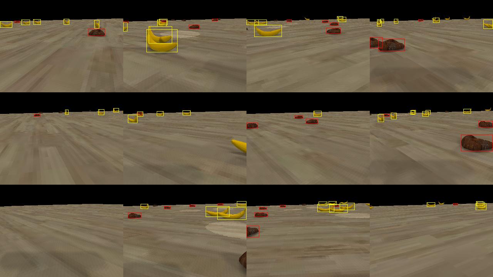
<sub>Caixas geradas automaticamente: amarelo = banana, vermelho = fezes.</sub>

<details>
<summary>⚠️ Detalhes que fizeram as caixas encaixarem</summary>

* **Calibração dos sinais da projeção.** Uma banana foi colocada em posições conhecidas, o centro dela foi detectado por cor e comparado com a projeção. O erro final ficou em 1–3 px.
* **Motores parados.** A cena vem salva com velocidades-alvo diferentes de zero, então o robô girava sozinho entre a captura e a leitura da pose.
* **Render explícito da câmera.** Com `explicitHandling` + `handleVisionSensor`, a imagem corresponde exatamente à pose do instante da captura.
* **Vértices reais da malha.** O *bounding box* do objeto não servia, porque a malha das fezes não está centrada na origem e o objeto está rotacionado.

</details>

### 2️⃣ Dataset ([`training/dataset/`](training/dataset))

| Split | Imagens | 🍌 Bananas | 💩 Fezes |
|---|---:|---:|---:|
| Treino (8 mapas) | 560 | 1 760 | 1 520 |
| Validação (1 mapa nunca visto) | 44 | 139 | 96 |
| **Total** | **604** | **1 899** | **1 616** |

Formato YOLO: um `.txt` por imagem com `classe cx cy w h` normalizados. Classes: `0 = banana`, `1 = poop`.

### 3️⃣ Treinamento ([`training/train.py`](training/train.py))

*Fine-tuning* a partir do **YOLO11s pré-treinado no COCO** (*transfer learning*):

```bash
python training/train.py
```

| Hiperparâmetro | Valor | Por quê |
|---|---|---|
| `imgsz` | 320 | Resolução nativa da Kinect (320×240). |
| `epochs` / `patience` | 80 / 25 | Converge por volta da época 20; o resto refina o mAP50-95. |
| `batch` | 32 | |
| `mosaic` / `fliplr` | 1,0 / 0,5 | Aumento de dados para generalizar para novos mapas. |

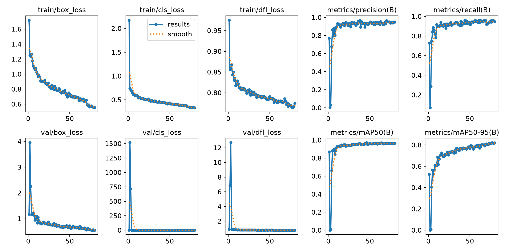
<sub>O pico nas épocas 2–3 é o *warm-up* do otimizador; depois as perdas caem de forma estável.</sub>

### 4️⃣ Resultados na validação

| Classe | Precisão | Recall | mAP50 | mAP50-95 |
|---|:---:|:---:|:---:|:---:|
| 🍌 banana | 0,931 | 0,969 | **0,978** | 0,854 |
| 💩 poop | 0,958 | 0,953 | **0,951** | 0,781 |
| **todas** | 0,944 | 0,961 | **0,965** | 0,818 |

<table>
<tr>
<td>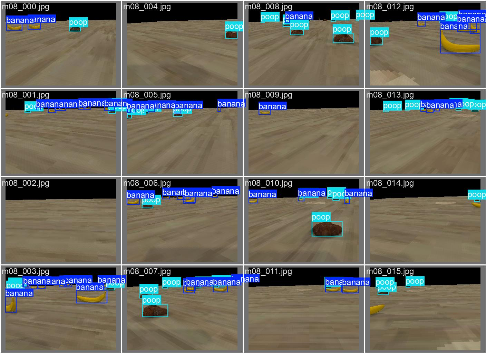<br/><sub>Rótulos (gerados automaticamente)</sub></td>
<td>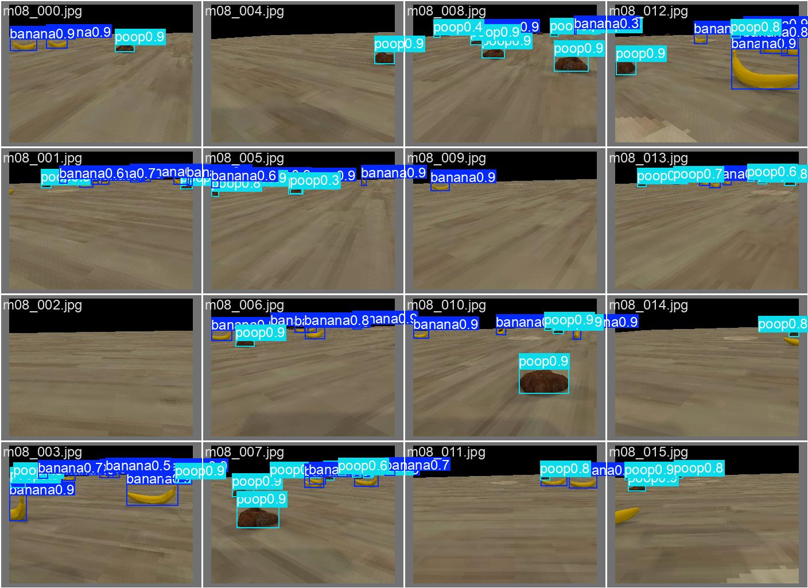<br/><sub>Predições do modelo</sub></td>
</tr>
</table>

<details>
<summary>📊 Matriz de confusão e curvas PR / F1</summary>

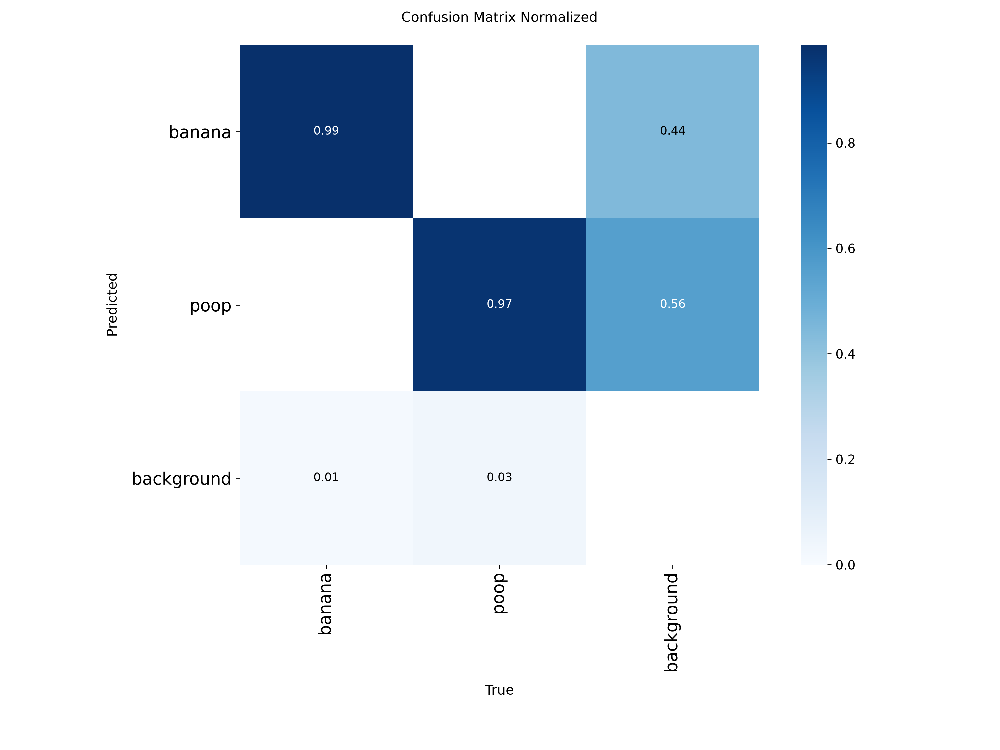 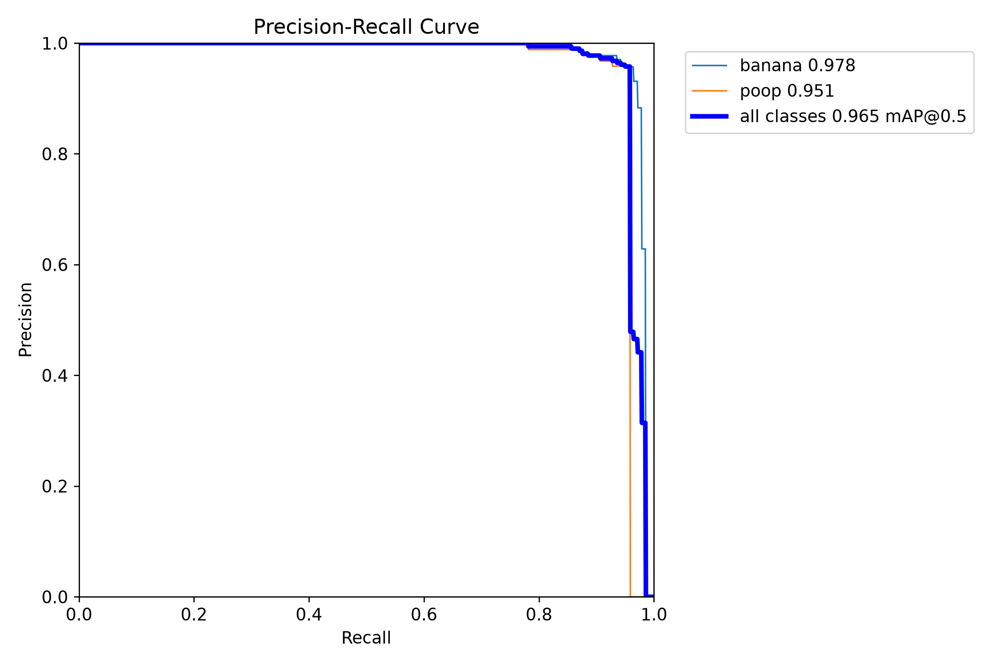
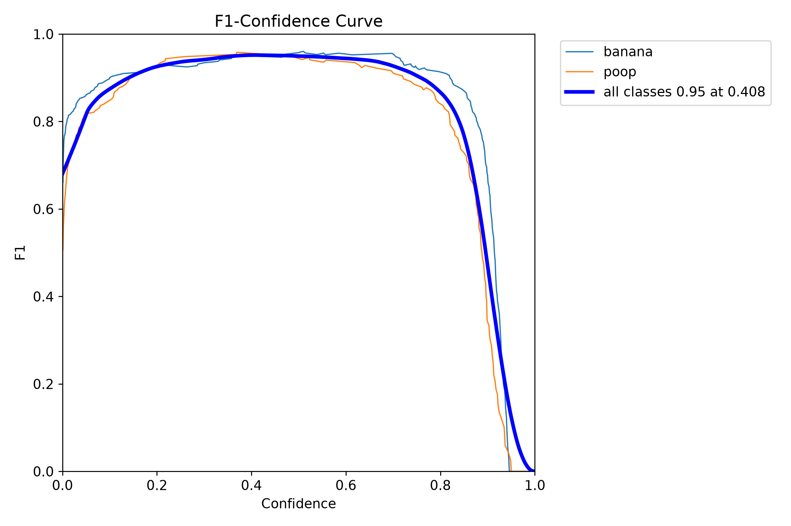 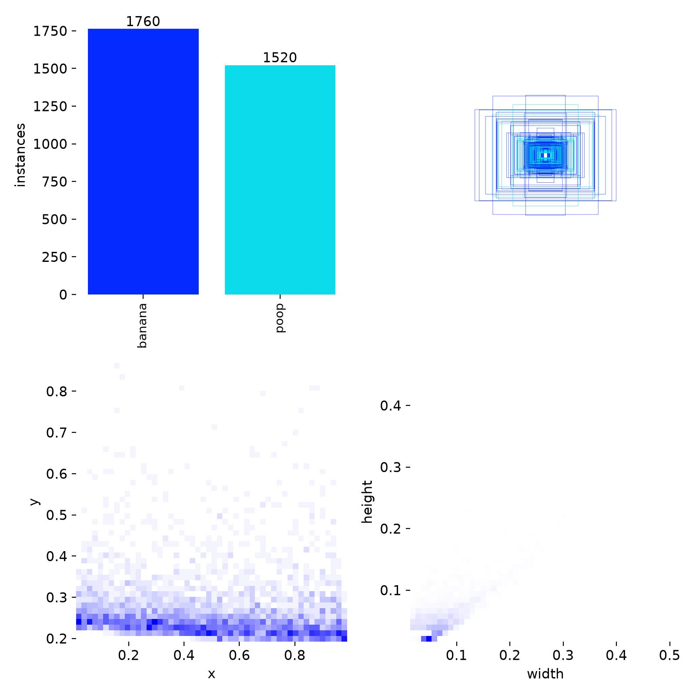

</details>

O modelo final está em [`ros2_ws/src/yolo_pf/models/banana_poop.pt`](ros2_ws/src/yolo_pf/models).

---

## 🗺️ Do pixel ao mapa

### 📏 Posição 3D (`detector_node`)
* **Distância:** percentil 30 da profundidade na região central da caixa. Ignora os pixels de chão que ficam atrás do objeto.
* **Conversão da profundidade:** usa os planos de recorte reais da Kinect, `z = 0,01 + d·(3,5 − 0,01)`.
  > O nó original do curso supõe *near* = 0,2 m e intrínsecos de 640×480, o que gera até ~19 cm de erro.
* **Filtros:** detecções a mais de 2,5 m (profundidade grosseira) ou cortadas pela borda da imagem são descartadas.

### 🧾 Mapa persistente (`object_map_node`)
* **Transformação:** cada detecção é levada para o frame `map` via TF, sem bloquear. Detecções com mais de 1 s são descartadas.
* **Sem duplicatas:** uma redetecção dentro do raio de fusão (banana 0,30 m, fezes 0,45 m) **atualiza a média** do objeto existente em vez de inserir outro.
* **Confirmação:** um objeto só entra no mapa depois de ser visto **3 vezes**.
* **Consolidação periódica** de entradas que convergiram para o mesmo lugar.
* **Rótulo duplo:** banana e fezes a menos de 0,25 m são o mesmo objeto com dois rótulos, e **vence o rótulo mais visto**.
* **Persistência:** os objetos **permanecem no mapa** quando saem do campo de visão.

> Precisão medida contra a verdade do simulador: **erro mediano de 6–12 cm** nos obstáculos.

---

## 🧲 Campo potencial (`potential_field_node`)

**Atrativo:** quadrático perto do alvo, cônico a mais de 1 m.

$$\vec F_{att} = \begin{cases} k_{att}\,(\vec q_g - \vec q) & d \le 1\,\text{m} \\[2pt] k_{att}\,\dfrac{\vec q_g - \vec q}{d} & d > 1\,\text{m}\end{cases}$$

**Repulsivo:** para cada fezes do mapa, com $\rho_0 = 0{,}8$ m.

$$\vec F_{rep} = k_{rep}\left(\frac{1}{\rho}-\frac{1}{\rho_0}\right)\frac{1}{\rho^2}\,\hat u \qquad (\rho<\rho_0)$$

* **Componente tangencial (vórtice):** contorna as fezes pelo lado do alvo, contra mínimos locais.
* **Atenuação perto do alvo** (Ge & Cui): uma banana ao lado de uma fezes continua alcançável.

**Controle:** $\theta^* = \text{atan2}(F_y, F_x)$, $v = \min(v_{max}, |F|)\cdot\max(0, \cos e)$, $\omega = k\,e$, depois cinemática inversa diferencial ($r = 0{,}05$ m, $L = 0{,}20$ m).

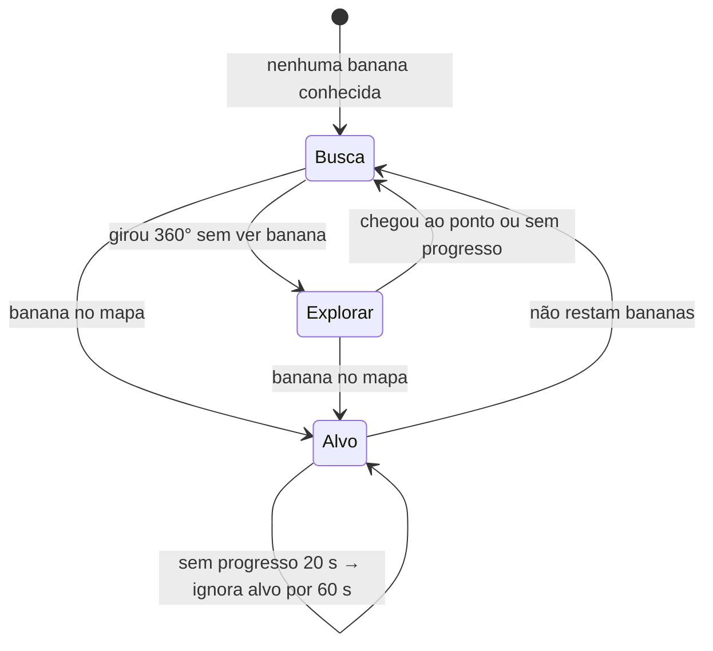

---

## 📈 Resultados de navegação

Avaliado contra a verdade do simulador (usada **apenas para medir**; o robô nunca a lê), cada execução em um **mapa aleatório novo**:

| Execução | 🍌 Coletadas | 💩 Atropeladas | ⏱️ Tempo simulado |
|:---:|:---:|:---:|:---:|
| 1 | **20/20** | **0** | 102 s |
| 2 | 19/20 *(cortada pelo limite de tempo)* | **0** | ~100 s |
| 3 | **20/20** | **0** | 81 s |

---

## 🚀 Como executar

**Requisitos:**
* ROS 2 Jazzy;
* CoppeliaSim 4.10 com a API remota ZMQ na porta 23000;
* GPU recomendada;
* um ambiente Python com `ultralytics`, `coppeliasim-zmqremoteapi-client` e `scipy` que enxergue os pacotes do ROS. Por exemplo:

```bash
uv venv --system-site-packages ~/.venvs/yolo_pf
VIRTUAL_ENV=~/.venvs/yolo_pf uv pip install ultralytics coppeliasim-zmqremoteapi-client scipy
```

**1. Compilar** (o colcon é executado com o Python do venv, para que os nós usem esse Python):
```bash
source /opt/ros/jazzy/setup.bash
cd ros2_ws
~/.venvs/yolo_pf/bin/python -m colcon build --symlink-install
```

**2. Abrir a cena** do curso no CoppeliaSim, **sem dar play**:
```bash
cd ~/CoppeliaSim_Edu_V4_10_0_rev0_Ubuntu24_04
./coppeliaSim.sh   # File → Open scene → pega_banana_potential_field.ttt
```

**3. Lançar o pipeline:**
```bash
source /opt/ros/jazzy/setup.bash
source ros2_ws/install/setup.bash
ros2 launch yolo_pf yolo_pf.launch.py              # rviz:=false para não abrir o RViz
```

**4. Ver o grafo de nós e tópicos** (opcional):
```bash
ros2 run rqt_graph rqt_graph
```

O **RViz** abre sozinho em vista superior. Ele mostra:
* a TF do robô e da câmera;
* o mapa persistente (🟡 bananas, 🟤 fezes);
* as detecções 3D ao vivo;
* a imagem anotada pelo YOLO.

> [!WARNING]
> * **Encerre com Ctrl+C.** Matar o `ros2 launch` de outra forma deixa nós órfãos que brigam pelos motores.
> * **Janela "Registration" do CoppeliaSim Edu.** Ela aparece periodicamente e **congela a simulação e o ZMQ**. Feche-a (*Cancel*) ou registre a licença Edu (gratuita para estudantes).
> * **Velocidade da cena.** Na máquina de teste, a cena roda a ~0,2× o tempo real mesmo sem ROS.

---

## 📁 Estrutura

```text
.
├── ros2_ws/src/
│   ├── yolo_pf/                   ← este projeto
│   │   ├── yolo_pf/               detector · mapa · campo potencial · velocidade
│   │   ├── launch/yolo_pf.launch.py
│   │   ├── rviz/yolo_pf.rviz
│   │   └── models/banana_poop.pt  YOLO11s treinado
│   └── ia368_pkg/                 pacote do curso (kinect_node, tf_node)
├── training/
│   ├── generate_dataset.py        geração + rotulagem automática
│   ├── train.py                   fine-tuning do YOLO11s
│   ├── dataset/                   604 imagens + rótulos
│   └── results/                   métricas por época, args
└── docs/images/                   figuras deste README
```

---

## 🙏 Créditos

O pacote `ros2_ws/src/ia368_pkg` e a cena do CoppeliaSim são material da disciplina **IA368 (UNICAMP)**, do repositório
[cesarbds/IA368ii](https://github.com/cesarbds/IA368ii). Os arquivos `.ttt` não estão incluídos aqui.

São deste projeto o pacote `yolo_pf`, o gerador de dataset, o dataset e o modelo treinado.
